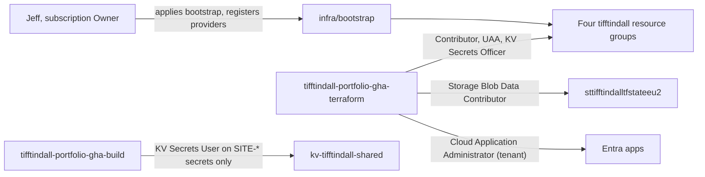

# Subscription hosting (shared now, dedicated later)

**Owner:** Jeff. Tiffany never runs anything in this runbook.

## Decision

Azure is currently blocking creation of a new subscription for Tiffany. Until it can be created, the site is hosted in an existing **company subscription** that Jeff owns:

| | Value |
|---|---|
| Current host subscription | `a558cbbf-b396-4d5f-b9ee-4ec191bc732b` (company operations) |
| Tenant | Same tenant as the future dedicated subscription |
| `subscription_mode` | `"shared"` |
| Target state | Tiffany's own subscription, `subscription_mode = "dedicated"` — see [`subscription-migration.md`](subscription-migration.md) |

Because the company subscription runs other workloads, the site is deployed so that it **cannot touch anything outside its own resource groups** and does not add cost tooling to the company subscription.

### What shared mode changes

| Concern | Shared (today) | Dedicated (later) |
|---|---|---|
| Terraform SP roles | Contributor, User Access Administrator, Key Vault Secrets Officer on Tiffany's resource groups only | Same (resource-group scope is kept) |
| Resource groups | Created by `infra/bootstrap` | Same names, moved in |
| Subscription budget | **Not created** | `budget-tifftindall-portfolio-monthly` |
| Consumption / CostManagement providers | Not registered by this repo | Registered by bootstrap |
| Azure Communication Services | **Removed** (no email/SMS) | Optional to reintroduce |
| App Insights, Log Analytics, alerts, action groups | Kept (resource-group scoped, site health only) | Kept |

Company cost reporting can still isolate the site's spend in Cost Analysis by filtering on tag `project = tifftindall-portfolio` or on the four resource groups.

### Resource inventory

All Azure and Entra names use the `tifftindall` prefix.

| Piece | Name |
|---|---|
| Tfstate RG / storage account / container | `rg-tifftindall-tfstate` / `sttifftindalltfstateeu2` / `tfstate` |
| Shared RG / vault | `rg-tifftindall-shared` / `kv-tifftindall-shared` |
| App RGs | `rg-tifftindall-portfolio-staging`, `rg-tifftindall-portfolio-prod` |
| Env vaults | `kv-tifftindall-staging`, `kv-tifftindall-prod` |
| Static Web Apps | `swa-tifftindall-portfolio-staging`, `swa-tifftindall-portfolio-prod` |
| Monitoring | `law-`, `appi-`, `webtest-`, `ag-`, `alert-tifftindall-*` |
| Entra apps (tenant) | `tifftindall-portfolio-gha-terraform`, `tifftindall-portfolio-gha-build`, `tifftindall-portfolio-gha-{env}`, `tifftindall-portfolio-{env}` |

### Role-scope model



- `infra/bootstrap` owns **all four** resource groups.
- **Build release** in CD runs without a GitHub environment and signs in as `tifftindall-portfolio-gha-build` (trusts pushes to `main`). It can read only the individual `SITE-*` secrets, so CD can build before the env stacks exist. The env stacks (`infra/environments/*`) only data-source their resource group.
- The env stacks set `resource_provider_registrations = "none"`; bootstrap (run by an Owner) registers the providers they need. The RG-scoped SP cannot register providers.
- The SP is never granted anything at subscription scope.

## Pre-flight (once, before the first apply)

Run in PowerShell. None of these print secrets.

```powershell
az login
az account set --subscription a558cbbf-b396-4d5f-b9ee-4ec191bc732b
az account show --query "{name:name, id:id, tenant:tenantId}" -o table
```

1. **You are Owner** on the subscription (needed to register providers and create the RG-scoped role assignments):

   ```powershell
   az role assignment list --assignee (az ad signed-in-user show --query id -o tsv) `
     --scope /subscriptions/a558cbbf-b396-4d5f-b9ee-4ec191bc732b `
     --query "[].roleDefinitionName" -o tsv
   ```

2. **You can assign Entra directory roles** (Privileged Role Administrator or Global Administrator). Bootstrap assigns Cloud Application Administrator to the Terraform SP.
3. **No name collisions** in the subscription:

   ```powershell
   az group list --query "[?starts_with(name, 'rg-tifftindall')].name" -o tsv
   ```

4. **Global names are free** (storage and Key Vault names are global; soft-deleted vaults still reserve their name):

   ```powershell
   az storage account check-name --name sttifftindalltfstateeu2 --query nameAvailable
   az keyvault list-deleted --query "[?starts_with(name, 'kv-tifftindall')].name" -o tsv
   ```

5. **Azure Policy allows the deployment.** Check the company subscription's policy assignments for allowed locations (`eastus2`), required tags, or storage/Key Vault restrictions that would deny the resources:

   ```powershell
   az policy assignment list --disable-scope-strict-match --query "[].displayName" -o tsv
   ```

6. Tools: Terraform >= 1.5, `gh` authenticated with admin on `jefftindall/educator-portfolio`.

## Deploy (today)

### 1. Local tfvars (gitignored)

Copy each example; they already contain the shared subscription ID.

```powershell
Copy-Item infra/bootstrap/terraform.tfvars.example infra/bootstrap/terraform.tfvars
Copy-Item infra/environments/staging/terraform.tfvars.example infra/environments/staging/terraform.tfvars
Copy-Item infra/environments/prod/terraform.tfvars.example infra/environments/prod/terraform.tfvars
```

Confirm `subscription_mode = "shared"` in `infra/bootstrap/terraform.tfvars`.

For prod, set `custom_domain = ""` in `terraform.tfvars` until DNS is ready, then follow [`custom-domain.md`](custom-domain.md).

### 2. Bootstrap

```powershell
$env:GH_TOKEN = (gh auth token)
cd infra/bootstrap
terraform init -input=false
terraform plan -input=false -out=tfplan
```

Check the plan before applying:

- 4 resource groups (`tfstate`, `shared`, `portfolio-staging`, `portfolio-prod`)
- 9 `azurerm_role_assignment.terraform_rg[...]` (3 roles x 3 RGs) plus the tfstate blob role
- **No** `azurerm_consumption_budget_subscription`
- **No** role assignment whose scope is `/subscriptions/a558...` alone

```powershell
terraform apply tfplan
cd ../..
```

Wait about 5 minutes for RBAC to propagate before the env applies.

### 3. Shared vault secrets

Bootstrap creates placeholders (`REPLACE_ME`) in `kv-tifftindall-shared`. Set real values from a temp file so nothing is echoed, then delete the file:

```powershell
$tmp = New-TemporaryFile
notepad $tmp   # paste the value with no trailing newline, save, close
az keyvault secret set --vault-name kv-tifftindall-shared --name SITE-CONTACT-EMAIL --file $tmp --only-show-errors -o none
Remove-Item $tmp
```

At minimum: `SITE-CONTACT-EMAIL`, and `ALERT-EMAIL` so alert action groups get a receiver. Leave the others as `REPLACE_ME` until the features that use them ship.

### 4. GitHub App for CI/CD Terraform (no GitHub secrets)

CI/CD runs Terraform as the bootstrap Terraform identity via Azure OIDC. The env stacks also manage GitHub environments and their variables, and GitHub's API can't accept an Azure token. So each job downloads the private key of a dedicated GitHub App (`tifftindall-portfolio-terraform`) from `kv-tifftindall-shared/TERRAFORM-GITHUB-APP-KEY` into a `0600` temp file, then [`scripts/github-app-token.mjs`](../../scripts/github-app-token.mjs) mints a 1-hour installation token limited to this repo and deletes the file. The repo has **no** stored GitHub secrets.

Terraform cannot create GitHub Apps, so a helper uses GitHub's manifest flow (two browser clicks: **Create GitHub App**, then **Install** on only `educator-portfolio`):

```powershell
node scripts/create-github-app.mjs
```

It writes the key straight into Key Vault (never printed, never in Terraform state) and prints the App ID and installation ID. Put both in `infra/bootstrap/terraform.tfvars` as `github_app_id` / `github_app_installation_id` and re-apply bootstrap. That publishes the repo variables `TF_GITHUB_APP_ID` and `TF_GITHUB_APP_INSTALLATION_ID`.

App permissions: Administration (write, to create environments), Environments (write, for environment variables), Metadata (read). To rotate the key, generate a new one in the App settings, store it with `az keyvault secret set --file`, delete the temp file, then delete the old key in GitHub.

Current app: ID `5189225`, installation `167927312`.

### 5. Staging, then prod

```powershell
cd infra/environments/staging
terraform init -input=false
terraform plan -input=false -out=tfplan
terraform apply tfplan
cd ../prod
terraform init -input=false
terraform plan -input=false -out=tfplan
terraform apply tfplan
cd ../../..
```

The backend uses the subscription from `az account set`, so stay on `a558cbbf-...` for the whole session.

### 6. Verify GitHub variables

```powershell
gh variable list --repo jefftindall/educator-portfolio
gh variable list --repo jefftindall/educator-portfolio --env staging
gh variable list --repo jefftindall/educator-portfolio --env prod
```

Expect `AZURE_TF_SUBSCRIPTION_ID` and both environments' `AZURE_SUBSCRIPTION_ID` to be `a558cbbf-b396-4d5f-b9ee-4ec191bc732b`. CI/CD Terraform jobs pass `AZURE_TF_SUBSCRIPTION_ID` as `TF_VAR_subscription_id`.

### 7. Ship through CD

Merge the PR to `main`. **CD: main** deploys staging, **Verify Staging** runs Playwright smoke + journeys, then production deploys and **Smoke Production** runs. See [`testing-strategy.md`](testing-strategy.md).

## Notes while in shared mode

- **No cost alerts for the site.** Watch spend in Cost Analysis using the `project` tag. Do not add budgets or cost exports to the company subscription from this repo.
- App Insights daily-cap notifications go to the **company subscription's** contacts, not Tiffany's ops contacts.
- Do not grant the Terraform SP anything at subscription scope. If a new resource needs a provider, add it to `infra/bootstrap/providers.tf` and re-apply bootstrap as Owner.
- Prod and shared Key Vaults have purge protection. Deleting them reserves the names for the retention period, so do not "start over" casually.

## Teardown (if ever needed)

Destroy `infra/environments/prod`, then `staging`, then `infra/bootstrap`. Purge-protected vault names stay reserved until their soft-delete retention ends.
